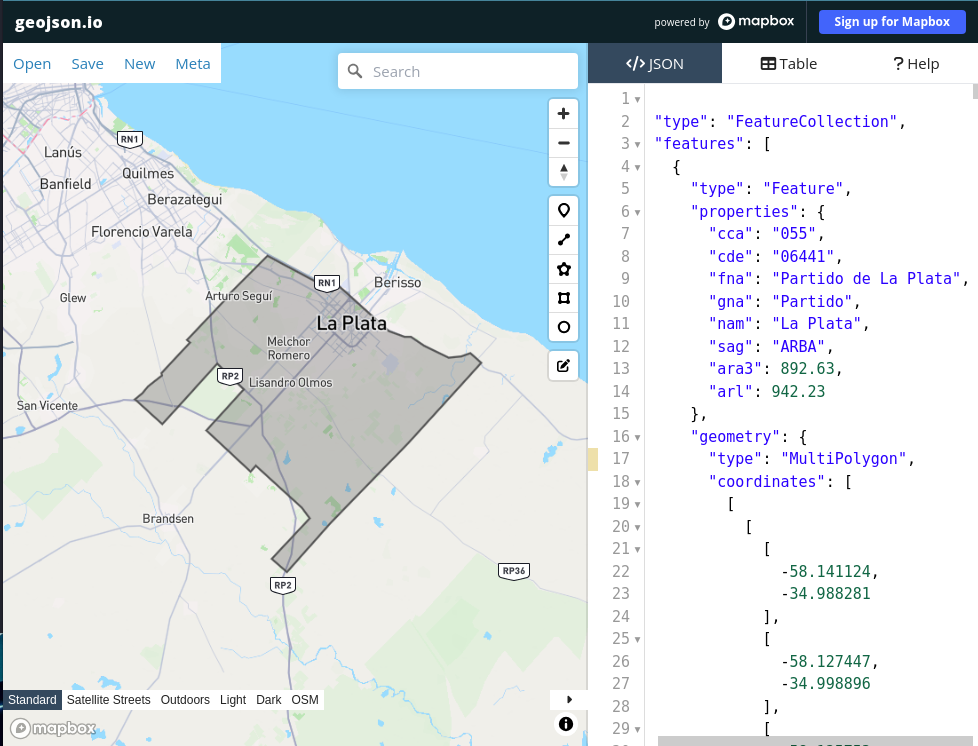
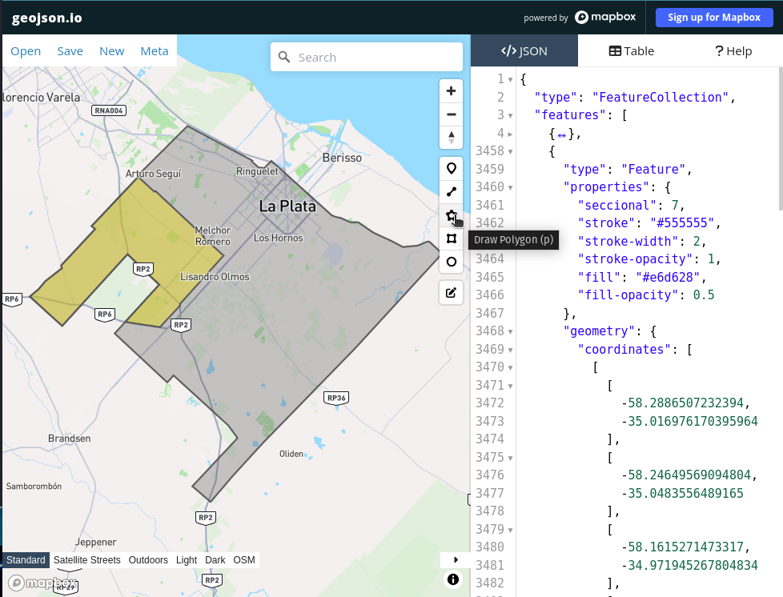

Esto es un projecto de [Next.js](https://nextjs.org/), el framework de React para producción más usado.

Aquí tienes videos en español para aprender a usar Next.js:
[Tutorial Next](https://www.youtube.com/watch?v=jMy4pVZMyLM) |
[Tutorial Server Actions](https://www.youtube.com/watch?v=m6KESRxAdK4)

## Inicio Rápido

Herramientas necesarias para el desarrollo y despliegue:

- [Node.js](https://nodejs.org/en/download/)
- [npm](https://www.npmjs.com/get-npm) (instalado con Node.js)
- [Vercel](https://vercel.com/) (esta es la plataforma de despliegue que usamos, la cuenta es gratuita y se puede vincular con el repositorio de github para hacer despliegues automáticos, ademas tiene servicio de base de datos)
- [Github CLI](https://cli.github.com/) (opcional, pero recomendado para clonar el repositorio)

Primero, clona el repositorio e instala las dependencias:

```bash
git clone git@github.com:seba-wetzel/mapa-policia-laplata.git
#Si tenes github cli instalado podes clonar el repositorio con el siguiente comando
gh repo clone seba-wetzel/mapa-policia-laplata
cd mapa-policia-laplata && npm install
 #inicia el servidor de desarrollo
npm run dev
```

Abri la siguiente url local [http://localhost:3000](http://localhost:3000) para ver el proyecto en tu navegador.

Ya podes modificar `app/page.tsx` para cargar los Geojson de tu mapa, y los cambios se van a recargar automáticamente.

Este proyecto ademas utiliza [`Tailwind`](https://tailwindcss.com/) para acelarar el desarrollo de la interfaz de usuario. Podes encontrar la documentación de Tailwind [aquí](https://tailwindcss.com/docs).
Tailwind es un framework de CSS que permite usar utility classes para estilizar los componentes, esto permite acelerar el desarrollo.

Para secciones especificas donde se neceito componentes mas complejos visualmente se utilizaron componentes de [`shadcn/ui`](https://ui.shadcn.com/) (no es una libreria de componentes ni un framework, son componentes que se pueden copiar y pegar en el proyecto, no es necesario instalar nada)

## Como se hacen los mapas?

En la mayoria de los casos no se va a encontrar ninguna de la informacion necesaria para hacer un mapa con la division del distrito, las seccionales (este es un termino de la policia bonaerense, en otras provincias puede ser diferente) y las comisarias de cada seccional. Por lo que se tuvo que hacer un relevamiento de la informaciony de manera "artesanal" generar los poligonos de cada distrito, seccional y comisaria.
Lo primero es conseguir el poligono del distrito, este lo conseguimos de una pagina de datos abiertos del gobierno de la provincia de Buenos Aires, en formato GeoJson. Este archivo en realiadad contienen todos los distritos de la provincia, por lo que se tuvo que filtrar el distrito de La Plata, para esto dentro de la carpeta tools hay un script que se encarga de hacer esto, el script se llama `filterGEOJsonByProperties.mjs` y se ejecuta con el siguiente comando:

```bash
node ./tools/filterGEOJsonByPropertie.mjs  --filter="cde=06441" --input=./geo/raw/limite_partidos.geojson --output=./geo/seccionales_la-plata.geojson
```

El script toma un archivo geojson de entrada, y filtra los poligonos que cumplan con la condicion que se le pasa por parametro, en este caso la condicion es que el campo `cde` sea igual a `06441` que es el codigo del distrito de La Plata. El archivo de salida es un geojson con solo el poligono del distrito de La Plata.
Este script puede servir de punto de partida para otros casos donde se necesite filtrar un archivo geojson por propiedades, o para entender como se contruye un GeoJson.

Cargando este geojsn en [GeoJson.io](https://geojson.io/) podemos ver si el poligono es correcto, y si no lo es, podemos editarlo manualmente. Una vez que el poligono del distrito es correcto, se puede exportar el archivo y guardarlo en la carpeta `src/data/geo` con la extension `.json` (esto para no tener que usar un loader).



Para las seccionales no hay informacion en un formato estandar, lo que conseguimos fue un pdf (esta en la carpeta docs si lo quieren ver) con un mapa como imagen donde se podian ver las calles que delimitaban cada seccional, asi que fue cuestion de dibujar los poligonos en [GeoJson.io](https://geojson.io/) y exportar el archivo. Una vez que el poligono de la seccional es correcto, se puede exportar el archivo y guardarlo en la carpeta `src/data/geo` con la extension `.json` (esto para no tener que usar un loader).



Es importante aprovechar esta etapa para colocar informacion importante en las propiedades de cada poligono, como el nombre de la seccional y datos graficos como el color.

Para las comisarias se hizo un relevamiento, pero tambien hubo disponibilidad de datos abiertos (desactualizados pero sirve como base para arrancar).
